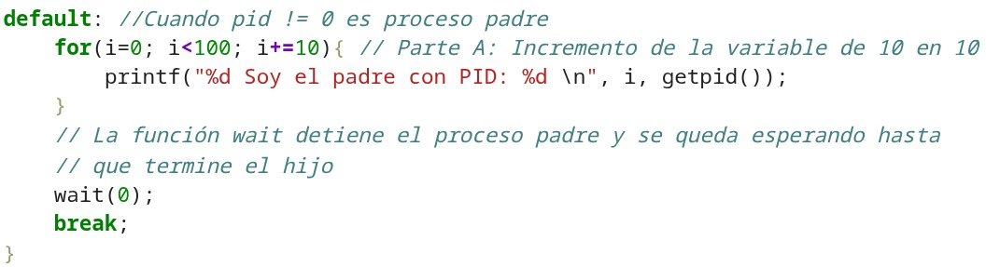
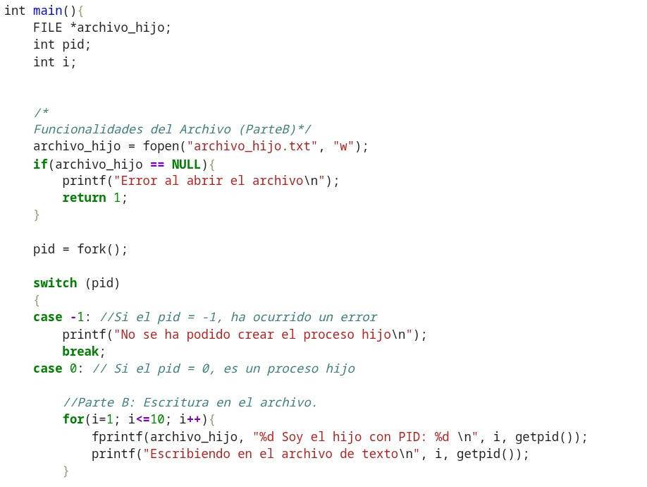
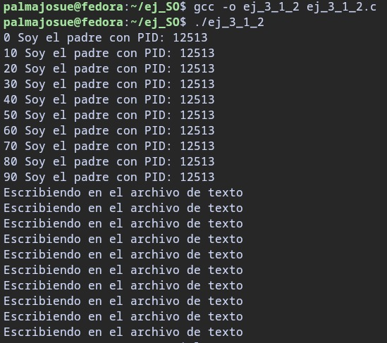
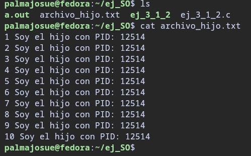

# 3.1.2 Uso de fork() en procesos padres e hijos (modificaciones en el código)

## Consigna del ejercicio:

Modifique el código de la Figura 2 para que el proceso padre incremente 10 veces el valor de una variable en pasos de 10, mientras que el proceso hijo registre cada valor en un archivo
de texto.

## Modificaciones realizadas:

1. Se realizó la modificación del bucle for en el caso de que el proceso tenga un valor diferente de 0 (es decir, es un proceso padre) de manera que cumpla con los requerimientos de la consigna, solo se cambió el condicional del bucle for y el incremento correspondiente a la variable temporal **i**, de manera que ahora se incremente 10 veces el valor de la variable en pasos de 10.





2. Se crearon las instancias correspondientes al requerimiento de la consigna que tienen que ver con el manejo de archivos, simplemente se declaró un **FILE** y se fueron utilizando los métodos correspondientes como **fopen()** y **fprintf()** para completar la consigna, logrando que se cree un archivo **.txt** con los valores del proceso hijo.




## Salidas del código:






## Código del Ejercicio completo:


```python
#include <stdlib.h>
#include <unistd.h>
#include <sys/wait.h>
#include <stdio.h>

int main(){
    FILE *archivo_hijo;
    int pid;
    int i;


    /*
    Funcionalidades del Archivo (ParteB)*/
    archivo_hijo = fopen("archivo_hijo.txt", "w");
    if(archivo_hijo == NULL){
        printf("Error al abrir el archivo\n");
        return 1;
    }

    pid = fork();

    switch (pid)
    {
    case -1: //Si el pid = -1, ha ocurrido un error
        printf("No se ha podido crear el proceso hijo\n");
        break;
    case 0: // Si el pid = 0, es un proceso hijo

        //Parte B: Escritura en el archivo.
        for(i=1; i<=10; i++){
            fprintf(archivo_hijo, "%d Soy el hijo con PID: %d \n", i, getpid());
            printf("Escribiendo en el archivo de texto\n", i, getpid());
        }

        break;
    default: //Cuando pid != 0 es proceso padre
        for(i=0; i<100; i+=10){ // Parte A: Incremento de la variable de 10 en 10
            printf("%d Soy el padre con PID: %d \n", i, getpid());
        }
        // La función wait detiene el proceso padre y se queda esperando hasta
        // que termine el hijo
        wait(0);
        break;
    }
}

```


```python
!gcc ej_3_1_2.c -o ej_3_1_2
```


```python
!./ej_3_1_2
```

    0 Soy el padre con PID: 8620 
    10 Soy el padre con PID: 8620 
    20 Soy el padre con PID: 8620 
    30 Soy el padre con PID: 8620 
    40 Soy el padre con PID: 8620 
    50 Soy el padre con PID: 8620 
    60 Soy el padre con PID: 8620 
    70 Soy el padre con PID: 8620 
    80 Soy el padre con PID: 8620 
    90 Soy el padre con PID: 8620 
    Escribiendo en el archivo de texto
    Escribiendo en el archivo de texto
    Escribiendo en el archivo de texto
    Escribiendo en el archivo de texto
    Escribiendo en el archivo de texto
    Escribiendo en el archivo de texto
    Escribiendo en el archivo de texto
    Escribiendo en el archivo de texto
    Escribiendo en el archivo de texto
    Escribiendo en el archivo de texto

