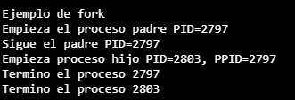

# 3.1 Uso de FORK
### 3.1.1 Ejecute el programa de la Figura 1 e identifique los valores PID y PPID de cada proceso.


```c
#include <stdio.h>
#include <unistd.h>

int main(){
	printf("Ejemplo de fork\n");
	printf("Empieza el proceso padre PID=%d\n", getpid());

	if (fork() == 0){
		//proceso hijo
		printf("Empieza proceso hijo PID=%d, PPID=%d\n", getpid(), getppid());
		sleep(1);
	}else{
		//proceso padre
		printf("Sigue el padre PID=%d\n", getpid());
		sleep(1);
	}

	printf("Termino el proceso %d\n", getpid());
	return 0;
}
```

### Salidas del código


