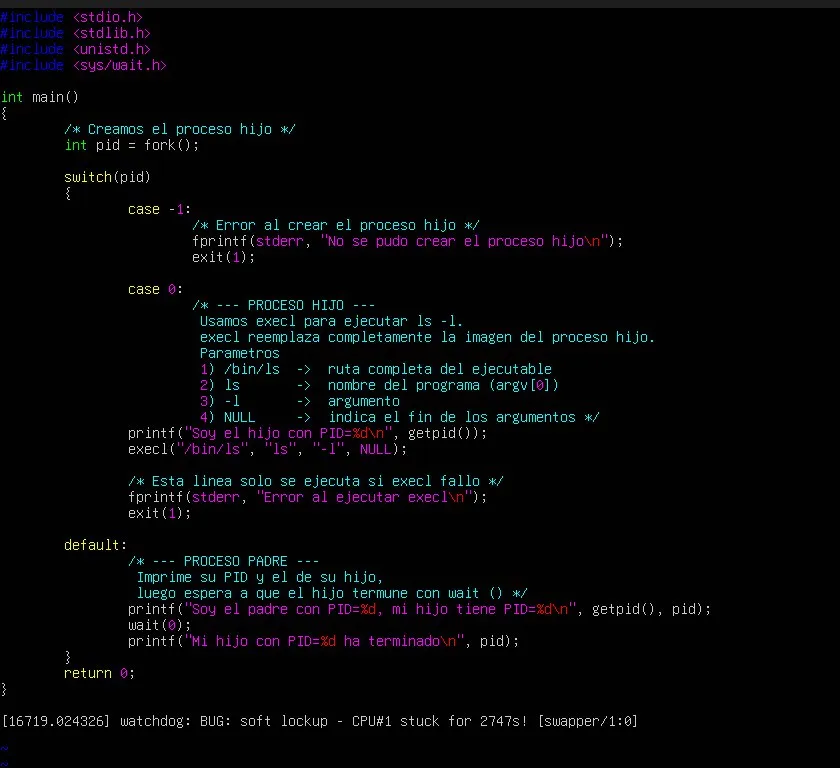

# Ejercicio 3.2.1 - Uso de EXEC

## Descripción
Se crea un proceso hijo mediante `fork()` que ejecuta el comando `ls -l`
usando la función `execl()`, la cual reemplaza completamente la imagen 
del proceso hijo por el nuevo programa indicado.

## Marco Teórico

### ¿Qué es exec?
La llamada `exec` produce la sustitución del programa invocador por el 
nuevo programa invocado. A diferencia de `fork()` que crea nuevos procesos, 
`exec` sustituye la imagen de memoria del proceso por otra nueva, 
reemplazando el código del programa, datos y pila.

### ¿Qué es execl?
`execl` es una de las variantes de la familia exec. Su declaración es:
```c
int execl(const char *path, const char *arg, ...);
```
**Parámetros:**
- `path`: ruta completa del ejecutable
- `arg`: nombre del programa (argv[0])
- `...`: argumentos adicionales
- `NULL`: obligatorio al final para indicar fin de argumentos

## Código

```c
#include 
#include 
#include 
#include <sys/wait.h>

int main()
{
    /* Creamos el proceso hijo */
    int pid = fork();

    switch(pid)
    {
        case -1:
            /* Error al crear el proceso hijo */
            fprintf(stderr, "No se pudo crear el proceso hijo\n");
            exit(1);

        case 0:
            /* --- PROCESO HIJO ---
               execl reemplaza completamente la imagen del proceso hijo.
               Parametros:
                 1) /bin/ls  -> ruta completa del ejecutable
                 2) ls       -> nombre del programa (argv[0])
                 3) -l       -> argumento
                 4) NULL     -> indica el fin de los argumentos */
            printf("Soy el hijo con PID=%d\n", getpid());
            execl("/bin/ls", "ls", "-l", NULL);

            /* Esta linea solo se ejecuta si execl fallo */
            fprintf(stderr, "Error al ejecutar execl\n");
            exit(1);

        default:
            /* --- PROCESO PADRE ---
               Imprime su PID y el de su hijo,
               luego espera a que el hijo termine con wait() */
            printf("Soy el padre con PID=%d, mi hijo tiene PID=%d\n", getpid(), pid);
            wait(0);
            printf("Mi hijo con PID=%d ha terminado\n", pid);
    }

    return 0;
}
```

## Compilación y ejecución

```bash
gcc ejercicio_exec.c -o ejercicio_exec
./ejercicio_exec
```

## Salida obtenida
```
Soy el padre con PID=2208, mi hijo tiene PID=2209
Soy el hijo con PID=2209
total 20
-rwxrwxr-x 1 leo leo 16264 May 10 23:49 ejercicio_exec
-rw-rw-r-- 1 leo leo  1099 May 10 23:37 ejercicio_exec.c
Mi hijo con PID=2209 ha terminado
```
## Evidencia

### Código en vi

<!-- Captura del código escrito en vi -->

### Compilación y ejecución

<!-- Captura que muestra gcc sin errores y la salida del programa -->

## Conclusiones
- `fork()` duplica el proceso actual. El padre recibe el PID del hijo (>0),
  el hijo recibe 0, y en caso de error retorna -1.
- `execl()` reemplaza completamente la imagen del proceso hijo — su código,
  datos y pila — con el programa indicado. Por eso todo lo que esté después
  de `execl()` solo se ejecuta si hubo un error.
- `wait(0)` en el padre evita que el hijo quede como proceso zombie, ya que
  el padre espera a que el hijo termine antes de continuar.