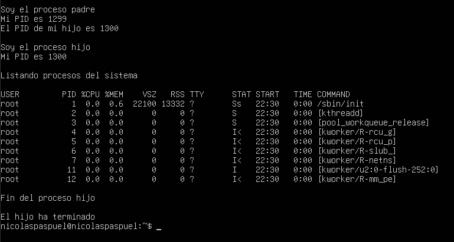

# 3.3.1 Uso del system

## Explicación
En este ejercicio se crea un proceso hijo utilizando `fork()`.  
Después, el hijo usa la función `system()` para ejecutar un comando del sistema operativo.

El comando utilizado fue:

```bash
ps -aux
```

Este comando sirve para mostrar los procesos que están ejecutándose en el sistema Linux.

Mientras el hijo realiza esta tarea, el proceso padre espera a que termine usando `wait()`.

## Código
```c
#include <stdio.h>
#include <stdlib.h>
#include <unistd.h>
#include <sys/wait.h>

int main() {

    int pid;

    pid = fork();

    switch(pid) {

        case -1:
            printf("Error al crear el proceso hijo\n");
            break;

        case 0:
            printf("=== PROCESO HIJO ===\n");
            printf("PID del hijo: %d\n", getpid());

            printf("\nProcesos activos del sistema:\n\n");

            system("ps -aux");

            printf("\nFin del proceso hijo\n");
            break;

        default:
            printf("=== PROCESO PADRE ===\n");
            printf("PID del padre: %d\n", getpid());
            printf("PID del hijo: %d\n", pid);

            wait(0);

            printf("\nEl hijo terminó correctamente\n");
            break;
    }

    return 0;
}
```
## Funciones utilizadas

- `fork()`:  crea un proceso hijo.
- `system()`:  ejecuta comandos del sistema.
- `wait()`:  hace que el padre espere al hijo.
- `getpid()`:  muestra el PID del proceso actual.

## Demostracion
 El programa se ejecuto correctamente 