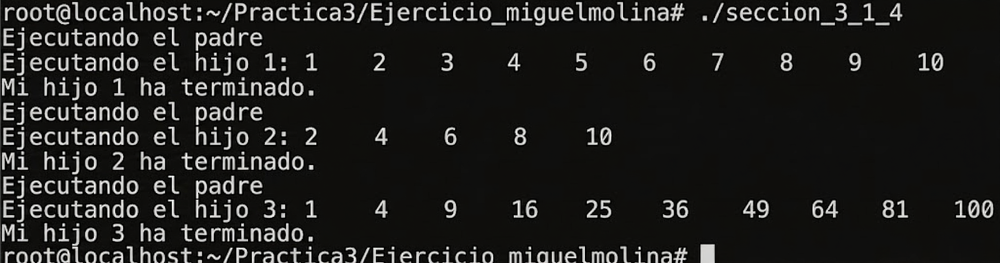

# 3.1.4 Creación de un proceso padre y tres procesos hijos

## Modificación realizada

Se modificó el código original de la Figura 4 para que cada uno de los procesos hijos realice una tarea diferente.

Las tareas implementadas fueron:

- Hijo 1: imprimir números del 1 al 10.
- Hijo 2: imprimir números pares del 1 al 10.
- Hijo 3: imprimir cuadrados de los números del 1 al 10.

## Explicación del código

La modificación se realizó dentro de la función `hijoHasAlgo(int numero)` utilizando estructuras condicionales `if` y `else if`.

Dependiendo del número del proceso hijo, cada uno ejecuta una tarea distinta mediante ciclos `for`.

Además, el proceso padre utiliza la función `wait(0)` para esperar la finalización de cada proceso hijo antes de continuar con la ejecución.

## Código

```c
#include <stdio.h>
#include <stdlib.h>
#include <unistd.h>
#include <sys/wait.h>

#define NUM_PROC 3

void hijoHasAlgo(int numero);

int main ()
{
    int i, pid;

    for (i = 1; i <= NUM_PROC; i++)
    {
        pid = fork();

        switch(pid)
        {
            case -1:
                fprintf(stderr, "Error al crear el proceso\n");
                break;

            case 0:
                hijoHasAlgo(i);
                exit(0);

            default:
                printf("Ejecutando el padre\n");
                wait(0);
                printf("Mi hijo %d ha terminado.\n", i);
                break;
        }
    }

    return 0;
}

void hijoHasAlgo(int numero)
{
    int i, MAX = 10;

    printf("Ejecutando el hijo %d:\n", numero);

    if(numero == 1)
    {
        printf("Numeros del 1 al 10:\n");

        for(i = 1; i <= MAX; i++)
        {
            printf("%d\t", i);
        }
    }
    else if(numero == 2)
    {
        printf("Numeros pares:\n");

        for(i = 2; i <= MAX; i += 2)
        {
            printf("%d\t", i);
        }
    }
    else if(numero == 3)
    {
        printf("Cuadrados de los numeros:\n");

        for(i = 1; i <= MAX; i++)
        {
            printf("%d\t", i * i);
        }
    }

    printf("\n");
}
```

## Resultado obtenido

Al ejecutar el programa se observó que:

- El proceso padre crea correctamente tres procesos hijos.
- Cada hijo ejecuta una tarea diferente.
- El proceso padre espera la finalización de cada hijo antes de continuar.

## Demostración
- "": salida del programa ejecutado correctamente.


